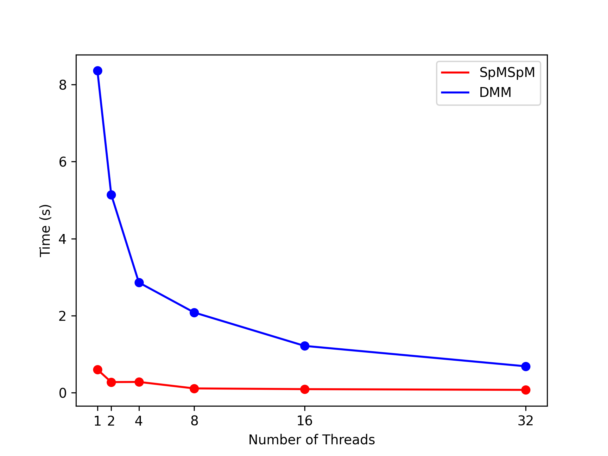

# Custom Sparse Tensor Compilation from PyTACO w/ SODA-OPT

SODA-OPT now features a few extensions to the MLIR sparse tensor compiler (now ```soda-sparse-compiler```) and the PyTACO frontend to support **separate compilation** of PyTACO code, **configurable MLIR-to-LLVM pipelines** and lowering steps, and **OpenMP parallelization**.

Also see the reference papers, talks, and slides at the bottom for other details.

## Installation

PyTACO support within SODA-OPT requires at least **OpenMP 5.0**. To enable, specify extra CMake options: ```-DENABLE_PYTACO=ON``` and ```-DENABLE_OPENMP=/path/to/libomp.so.5```, and an extra target: ```soda-pytaco```.

The helper script supports extra options and targets:

```sh
# General usage of build_soda.sh
./build_tools/build_soda.sh \
    <source_dir> \
    <install_dir> \
    <build_dir> \
    <path/to/llvm/build/dir> \
    <path/to/llvm/install/dir> \
    "-DENABLE_PYTACO=ON -DENABLE_OPENMP=/path/to/libomp.so.5" \
    soda-pytaco
```

### Source Files

We ported MLIR's ```sparse-compiler``` pipeline to SODA-OPT and integrated OpenMP support. This implementation can be found in ```${PROJ_ROOT_DIR}/lib/Dialect/SparseTensor``` and ```{PROJ_ROOT_DIR}/include/soda/Dialect/SparseTensor```

To support end-to-end, JIT, parallelizing, and/or separate compilation of PyTACO apps, we extended MLIR-PyTACO's implementation into the ```SODASparseCompiler```, which lives in ```{PROJ_ROOT_DIR}/python/mlir_soda/pytaco``` (referred to as ```$PYTACO``` for the rest of this tutorial).

Example PyTACO applications that we support are located in ```$PYTACO/apps```.

Tests on end-to-end PyTACO compilation and OpenMP parallelization can be found in ```${PROJ_ROOT_DIR}/test/python``` and ```${PROJ_ROOT_DIR}/test/Runner/SparseTensor/parallel```.

Finally, we provide a tool to invoke all of the aforementioned features: ```soda-pytaco```, which lives in ```{PROJ_ROOT_DIR}/tools/soda-pytaco```

## Compiling Sparse Kernels

### TL;DR

If you'd like to generate all tutorial-related files and examine them yourself, run ```everything.sh```:

```bash
./everything.sh <path/to/mlir/root> <path/to/soda-opt/root> <path/to/libomp.so.5> ;
source ENV ;
```

## Sparse Kernels

To get an idea of what a sparse kernel might look like, let's take a look at SpMVMul (sparse matrix-vector multiplication ; ```${PYTACO}/apps/SpMVMul.py```).

```python
import mlir_soda.pytaco.mlir_pytaco_ext as ext
from tools import mlir_pytaco_api as pt

def SpMVMul(rows: int, cols: int) -> List[Tuple['Tensor', str]]:
    # Set up matrix and vectors. Each tensor is 
    # instantiated with a storage format (e.g. 
    # pt.csr) ; see the API in ${PYTACO}.
    #
    # Sparse storage formats are exposed in 'ext'.
    M = pt.tensor([rows, cols], ext.csr)
    v = pt.tensor([M.shape[1]], ext.dv)
    z = pt.tensor([M.shape[0]], ext.dv)

    # Declare index variables
    i, j = pt.get_index_vars(2)
    
    # Define computation and compile
    z[i] = M[i, j] * v[j]

    # Return the tensor assignments to compile
    return [(z, 'z')]
```

PyTACO directly uses tensor index notation as its primary language feature. Here, the tensor assignemnt to ```z``` represents the entire SpMVMul kernel.

Unlike many tests in PyTACO's suite, the kernels we provide in ```apps/``` do not use PyTACO's I/O API or other features directly (e.g. for JIT). We focus on separate compilation (more on this soon), so it is unnecessary to specify input tensors, dimensions as literals, or output files in the kernel implementation itself. Instead, the tensor to compile is simply returned (```z```).

As a result, PyTACO code should resemble a ***declarative*** structure when compiling with SODA-OPT. The inputs to this function are ***not*** entire tensors, but simply a specification of the tensor dimensions that the compiler should generate.

There are 9 kernels added so far (see their [definitions as tensor index notation](https://weiya711.github.io/publications/asplos2023-sam.pdf) on page 10):
1. SpMVMul (i.e. SpMV)
2. SpMSpMAdd (i.e. MMAdd)
3. SpMVMul (i.e. SpMSpM)
4. MTTKRP
5. SpTVMul (i.e. TTV)
6. SpTMMul (i.e. TTM)
7. Reduce1D
8. Reduce2D
9. InnerProd

### Separate Compilation

The upstream PyTACO frontend compiles code to MLIR functions in JIT mode ; it invokes the built-in execution engine. In SODA-OPT, the PyTACO frontend is extended to simply emit the high-level MLIR (in ```linalg```, ```sparse_tensor```, etc.) for each tensor assignment in a kernel. The execution engine is not invoked. 

Separate compilation allows us to invoke pipelines other than upstream's ```sparse-compiler``` (e.g. with OpenMP), add specifically configured parallelization options, and debug at each lowering step. These are materialized in the ```soda-sparse-compiler``` pipeline, which can be invoked via ```soda-opt``` and with ```soda-pytaco```, which is the wrapper tool.

Our extension is implemented as the ```SODASparseCompiler``` class in ```${PYTACO}/soda_sparse_compiler.py```. It exposes APIs that splits code generation, progressive lowering, and JIT execution into multiple steps. Doing so allows users of ```SODASparseCompiler``` to configure their own end-to-end support with a Python script. The helper method ```SODASparseCompiler.compile_and_run``` is an example of simple end-to-end support that invokes all lowering and execution steps:

```python
def compile_and_run(
    self,
    mlir_options: MLIRGenOptions,
    llvm_options: LLVMIRGenOptions,
    run_options: RunOptions,
    kernel_inputs: Tuple[int]
) -> Capture:
    """
    Simple end-to-end driver for compiling and running the 
    kernel with the given options.

    Args:
        mlir_options: Config to produce MLIR from PyTACO (w/ MLIR-PyTACO)
        llvm_options: Config to lower MLIR to LLVM-IR (w/ soda-opt, mlir-translate)
        run_options: Config to run the lowered MLIR (w/ mlir-cpu-runner)
        kernel_inputs: A tuple of input sizes to compile the kernel with.

    Returns:
        Capture w/ all intermediate IRs, logs, and runs.
    """

    # Set up capture
    cap: Capture = Capture()

    # Compile to MLIR
    self.compile_pytaco_to_mlir(mlir_options, cap, kernel_inputs)

    # Compile to LLVM
    self.compile_mlir_to_llvm_with_shell(llvm_options, cap, cap.mlir)

    # Run
    self.run_compiled_kernel_with_shell(run_options, cap, cap.lowered_mlir)

    return cap

```

The compiler does not produce any files; it instead writes all generated code and execution results in ***a ```Capture``` object***, which stores them as text and also maintains metadata about the kernel. We leave file generation up to the user (see ```soda-pytaco``` below).

All options classes (```MLIRGenOptions```, ```LLVMIRGenOptions```, and ```RunOptions```) and the ```Capture``` class are defined in ```${PYTACO}/soda_sparse_compiler.py```.


### Code Generation Tools

SODA-OPT provides the ```soda-pytaco``` tool to compile and run PyTACO code using a traditional compiler interface (i.e. with command line support, file generation, etc.). 

The tool acts as a user of ```SODASparseCompiler``` and provides a high-level of configurability over PyTACO compilation:
1. PyTACO frontend compilation to high-level MLIR.
2. Lowering and parallelization to the ```llvm``` dialect via compiler options and the ```omp``` (OpenMP) dialect (via ```soda-opt```)
3. Translation from the ```llvm``` dialect to LLVM-IR (via ```mlir-translate```)
4. Running lowered MLIR code (via ```mlir-cpu-runner```).
5. Sparse tensor generation (i.e. for running PyTACO kernels)

```soda-pytaco``` can be generally invoked as:
```bash
soda-pytaco --v \
    --actions {mlir,llvm,run,gen-tensors} \
    --output-dir /path/to/outputs \
    --kernel <kernel_name> \
    --kernel-dir /path/to/kernel/parent/dir \
    --inps <inputs_to_python_kernel_function> \
```

See ```soda-pytaco --help``` for full usage. For end-to-end support, ```soda-pytaco``` expects the ```--input-tensor-files``` parameter to run the kernel.

## An Example: SpMVMul

We'll walk through end-to-end compilation and execution of sparse matrix-vector multiplication (SpMVMul) using ```soda-pytaco```.

### Setup

First, we'll run ```configure.sh``` in the tutorial directory to set up paths and libraries:

```bash
./configure.sh <path/to/mlir/root> <path/to/soda-opt/root> <path/to/libomp.so.5> ;
source ENV ;
```

```ENV``` will contain several environment variables that we'll refer to below (namely ```$PTT```: directory for PyTACO Tutorial).

### Generating High-Level MLIR

Now, we'll generate high-level MLIR from SpMVMul:

```bash
mkdir -p ${PTT}/output ;
soda-pytaco --v \
    --actions mlir \
    --output-dir ${PTT}/output \
    --kernel SpMVMul --kernel-dir ${PTT} --inps 16 16 \
    --emit-entry-point=False
```

You should see the following output to the console:

```bash
========================================================
SpMVMul
========================================================
========================================================
Generating MLIR for SpMVMul ...
--------------------------------------------------------
[DEBUG]: Options:
[DEBUG]:   emit-entry-point: False
[DEBUG]:   print-input-tensors: False
[DEBUG]:   print-output-tensors: False
[DEBUG]:   add-timing: False
[DEBUG]: MLIR written to ${PTT}/output/SpMVMul_z_16_16.mlir
[DEBUG]: DONE.
========================================================
```

A note: ```soda-pytaco``` has many default parameters set to simplify end-to-end support, 
one of which is ```emit-entry-point``` (provides a ```main``` function to run the kernel with ```mlir-cpu-runner``` ; covered later). Since we're only generating MLIR at this step, we've set that 
option to ```False```.

The high-level MLIR can be found in ```${PTT}/output/SpMVMul_z_16_16.mlir```:
```llvm
#map = affine_map<(d0, d1) -> (d0, d1)>
#map1 = affine_map<(d0, d1) -> (d1)>
#map2 = affine_map<(d0, d1) -> (d0)>
module {
  func.func @SpMVMul_z.main(%arg0: tensor<16x16xf32, #sparse_tensor.encoding<{ lvlTypes = [ "dense", "compressed" ] }>>, %arg1: tensor<16xf32, #sparse_tensor.encoding<{ lvlTypes = [ "dense" ] }>>) -> tensor<16xf32, #sparse_tensor.encoding<{ lvlTypes = [ "dense" ] }>> attributes {llvm.emit_c_interface} {
    %0 = bufferization.alloc_tensor() : tensor<16xf32, #sparse_tensor.encoding<{ lvlTypes = [ "dense" ] }>>
    %1 = linalg.generic {indexing_maps = [#map, #map1, #map2], iterator_types = ["parallel", "reduction"]} ins(%arg0, %arg1 : tensor<16x16xf32, #sparse_tensor.encoding<{ lvlTypes = [ "dense", "compressed" ] }>>, tensor<16xf32, #sparse_tensor.encoding<{ lvlTypes = [ "dense" ] }>>) outs(%0 : tensor<16xf32, #sparse_tensor.encoding<{ lvlTypes = [ "dense" ] }>>) {
    ^bb0(%in: f32, %in_0: f32, %out: f32):
      %2 = arith.mulf %in, %in_0 : f32
      %3 = arith.addf %out, %2 : f32
      linalg.yield %3 : f32
    } -> tensor<16xf32, #sparse_tensor.encoding<{ lvlTypes = [ "dense" ] }>>
    return %1 : tensor<16xf32, #sparse_tensor.encoding<{ lvlTypes = [ "dense" ] }>>
  }
}
```

When MLIR-PyTACO generates the IR, the core computation is always expressed using ```linalg.generic```.
It also encodes all tensors using ```#sparse_tensor.encoding``` attributes even for dense tensors. 

The parameter ```--inps 16 16``` sets the Python function's arguments as ```rows=16``` and ```cols=16```, and the compiler generates the high-level MLIR to perform a sparse matrix-vector multiplication using a 16x16 matrix and 16x16 vector. 

```SODASparseCompiler``` formats kernel function names as ```{kernel_name}_{tensor_name}.main```.

All generated files will be formatted as ```{kernel_name}_{tensor_name}_{inps}.EXT``` and written to ```${PTT}/output```.


### Lowering to LLVM-IR

We can use ```soda-pytaco``` again to generate code ***and*** lower to LLVM-IR:

```bash
soda-pytaco --v \
    --actions mlir llvm \
    --output-dir ${PTT}/output \
    --kernel SpMVMul --kernel-dir ${PTT} --inps 16 16 \
    --emit-entry-point=False
```

You should see this additional output to the console:
```bash
============================================================================                                                                                                                     
Lowering SpMVMul [${PTT}/output/SpMVMul_z_16_16.mlir] ...                                                                                
----------------------------------------------------------------------------                                                                                                                               
[CMD]: soda-opt -soda-sparse-compiler="parallelization-strategy=any-storage-any-loop enable-runtime-library=0 enable-openmp=1 " -mlir-print-ir-after-all=1 ${PTT}/output/SpMVMul_z_16_16.mlir -o ${PTT}/output/SpMVMul_z_16_16.lowered.mlir 2>&1 ${PTT}/output/SpMVMul_z_16_16.lowering.out                                                                                                                                                
[CMD]: mlir-translate -mlir-to-llvmir ${PTT}/output/SpMVMul_z_16_16.lowered.mlir -o ${PTT}/output/SpMVMul_z_16_16.ll                                                                                                                                                                 
[DEBUG]: Lowered MLIR written to ${PTT}/output/SpMVMul_z_16_16.lowered.mlir                                                              
[DEBUG]: Lowering log written to ${PTT}/output/SpMVMul_z_16_16.lowering.out                                                                   
[DEBUG]: LLVM-IR written to ${PTT}/output/SpMVMul_z_16_16.ll                                                                                    
[DEBUG]: DONE.                                     
============================================================================   
```

In this setting, the high-level MLIR (```.mlir``` file) stays the same but we produce
three additional files:
1. The lowered MLIR (```.lowered.mlir```) mainly in the ```llvm``` and ```omp``` dialects ; by invoking ```soda-opt -soda-sparse-compiler ...```
2. The lowering steps (```.lowering.out```) ; by adding the ```-mlir-print-ir-after-all``` option when invoking ```soda-opt```.
3. The LLVM-IR (```.ll```) ; by invoking ```mlir-translate```

The corresponding commands are printed to the console.

By default, ```soda-pytaco``` parallelizes the code by adding ```-parallelization-strategy=any-storage-any-loop``` and ```-enable-openmp``` to ```soda-sparse-compiler``` (these can be disabled ; see ```soda-pytaco --help```). This parallelization strategy lowers the
```sparse_tensor``` dialect to the ```scf``` dialect and produces as many ```scf.parallel``` and ```scf.reduce``` operations as possible during sparsification. ```-enable-openmp``` adds conversion passes to the ```omp``` dialect that targets parallel SCF loops (look for  "```convert-scf-to-openmp```" in ```${PTT}/output/SpMVMul_z_16_16.lowering.out```).

For SpMVMul, you should see code in the ```omp``` and ```llvm``` dialects in the lowered MLIR, similar to this snippet:

```llvm
  ^bb3:  // pred: ^bb1
    %51 = llvm.insertvalue %29, %46[1, 0] : !llvm.struct<(array<1 x i64>, array<1 x i64>)> 
    omp.parallel   {
      %55 = llvm.alloca %33 x f32 : (i64) -> !llvm.ptr
      omp.wsloop   for  (%arg22) : i64 = (%32) to (%31) step (%30) {
        %56 = llvm.getelementptr %37[%arg22] : (!llvm.ptr, i64) -> !llvm.ptr, f32
        %57 = llvm.load %56 : !llvm.ptr -> f32
        %58 = llvm.extractvalue %5[1] : !llvm.struct<(ptr, ptr, i64, array<1 x i64>, array<1 x i64>)> 
        %59 = llvm.getelementptr %58[%arg22] : (!llvm.ptr, i64) -> !llvm.ptr, i64
        %60 = llvm.load %59 : !llvm.ptr -> i64
        %61 = llvm.add %arg22, %30  : i64
        %62 = llvm.extractvalue %5[1] : !llvm.struct<(ptr, ptr, i64, array<1 x i64>, array<1 x i64>)> 
        %63 = llvm.getelementptr %62[%61] : (!llvm.ptr, i64) -> !llvm.ptr, i64
        %64 = llvm.load %63 : !llvm.ptr -> i64
        llvm.store %57, %55 : f32, !llvm.ptr
        omp.parallel   {
          omp.wsloop   reduction(@__scf_reduction -> %55 : !llvm.ptr) for  (%arg23) : i64 = (%60) to (%64) step (%30) {
            %67 = llvm.intr.stacksave : !llvm.ptr
            llvm.br ^bb1
          ^bb1:  // pred: ^bb0
            %68 = llvm.extractvalue %11[1] : !llvm.struct<(ptr, ptr, i64, array<1 x i64>, array<1 x i64>)> 
            %69 = llvm.getelementptr %68[%arg23] : (!llvm.ptr, i64) -> !llvm.ptr, i64
            %70 = llvm.load %69 : !llvm.ptr -> i64
            %71 = llvm.extractvalue %17[1] : !llvm.struct<(ptr, ptr, i64, array<1 x i64>, array<1 x i64>)> 
            %72 = llvm.getelementptr %71[%arg23] : (!llvm.ptr, i64) -> !llvm.ptr, f32
            %73 = llvm.load %72 : !llvm.ptr -> f32
            %74 = llvm.extractvalue %23[1] : !llvm.struct<(ptr, ptr, i64, array<1 x i64>, array<1 x i64>)> 
            %75 = llvm.getelementptr %74[%70] : (!llvm.ptr, i64) -> !llvm.ptr, f32
            %76 = llvm.load %75 : !llvm.ptr -> f32
            %77 = llvm.fmul %73, %76  : f32
            omp.reduction %77, %55 : f32, !llvm.ptr
            llvm.intr.stackrestore %67 : !llvm.ptr
            llvm.br ^bb2
          ^bb2:  // pred: ^bb1
            omp.yield
          }
          omp.terminator
        }
        %65 = llvm.load %55 : !llvm.ptr -> f32
        %66 = llvm.getelementptr %37[%arg22] : (!llvm.ptr, i64) -> !llvm.ptr, f32
        llvm.store %65, %66 : f32, !llvm.ptr
        omp.yield
      }
      omp.terminator
    }
```

In the lowered LLVM-IR (```.ll```), **no runtime calls or intrinsics are generated other than those relavant to OpenMP**. This is accomplished by defaulting ```-enable-runtime-library=0``` internally in the ```soda-opt --soda-sparse-compiler``` invocation. This decision should streamline compilation flows through an HLS backend or library-targeting backend.

### End-to-End Compilation and Execution

Finally, we'll use ```soda-pytaco``` to generate all IRs ***and*** execute the kernel:

```bash
soda-pytaco --v \
    --actions mlir llvm run \
    --output-dir ${PTT}/output \
    --kernel SpMVMul --kernel-dir ${PTT} --inps 16 16 \
    --emit-entry-point=True --add-timing=True \
    --input-tensor-files ${PTT}/tensors/M16.tns ${PTT}/tensors/v16.tns
```

You should see this additional output to the console:

```bash
Running SpMVMul [${PTT}/output/SpMVMul_z_16_16.lowered.mlir]...
----------------------------------------------------------------------------
[CMD]: OMP_NUM_THREADS=4 TENSOR0=${PTT}/tensors/M16.tns TENSOR1=${PTT}/tensors/v16.tns \
    mlir-cpu-runner -e=main -entry-point-result=void \
        -shared-libs=/home/sgh185/soda-llvm/build/lib/libmlir_runner_utils.so,/home/sgh185/soda-llvm/build/lib/libmlir_c_runner_utils.so,/home/sgh185/new-soda-opt/build/lib/libsoda_runner_ext.so,/lib/x86_64-linux-gnu/libomp.so.5 \
        ${PTT}/output/SpMVMul_z_16_16.lowered.mlir \
            1> ${PTT}/output/SpMVMul_z_16_16.run.out \
            2> ${PTT}/output/SpMVMul_z_16_16.time
[DEBUG]: Tensors printed to ${PTT}/output/SpMVMul_z_16_16.run.out
[DEBUG]: Timing recorded in ${PTT}/output/SpMVMul_z_16_16.time
[DEBUG]: DONE.
============================================================================ 
```

Since we've invoked the "```run```" action, we'll need:
1. A ```main```-like function (i.e. an entry point) for ```mlir-cpu-runner``` to start the execution.
2. Tensors that correspond to the input matrix and vector (```M``` and ```v```) in the ```SpMVMul``` Python function.
3. Shared libraries for ```mlir-cpu-runner``` that contain runtime functions for sparse tensor handling and OpenMP execution.
4. A configuration on the number of OpenMP threads.

Let's now dissect the command, console output, and high-level MLIR to address these 4 requirements:

1. ```--emit-entry-point``` produces a function ```main``` that is passed as ```mlir-cpu-runner -entry=main ...```. 
2. Input tensors are loaded by upstream MLIR's sparse tensor runtime and are communicated via environment variables. We set ```TENSOR0``` and ```TENSOR1``` to file paths containing tensors in COO format. Note that the ***order*** of inputs matters ; these correspond to ```M``` and ```v``` in the Python function ```SpMVMul```, respectively, since ```M``` was defined before ```v```.
3. Shared libraries required by ```mlir-cpu-runner``` are fetched from environment variables set in ```configure.sh``` and ```ENV```. They include ```RUNNER_UTILS```, ```C_RUNNER_UTILS```, and ```SODA_RUNNER_EXT```, which contain runtime functions for sparse tensor handling, timing, etc. Finally ```OPENMP_LIB``` is required for parallel execution. ```soda-pytaco``` automatically passes these libraries using ```-shared-libs```.
4. We set the number of threads using the standard OpenMP environment variable: ```OMP_NUM_THREADS```.

Consequently, the high-level MLIR will also change and include the ```main``` function, extra setup code, timing instrumentation (set via ```--add-timing```), and output tensor printing (on by default), as now seen in ```${PTT}/output/SpMVMul_z_16_16.mlir```. We document the MLIR below:

```llvm
#map = affine_map<(d0, d1) -> (d0, d1)>
#map1 = affine_map<(d0, d1) -> (d1)>
#map2 = affine_map<(d0, d1) -> (d0)>
module {
  // From upstream MLIR's sparse tensor runtime -> returns a file pointer 
  // based on the environment variable TENSOR{index} (i.e. TENSOR0).
  // 'sparse_tensor.new' takes this pointer as input.
  func.func private @getTensorFilename(index) -> !llvm.ptr<i8>

  // From upstream MLIR's runtime utilities -> returns the current time.
  func.func private @rtclock() -> f64

  // From SODA's runtime extensions -> Prints the interval b/w rtclock() calls.
  func.func private @rtclock_interval(f64, f64)

  // 'sparse_tensor.out' takes a file pointer as input when writing out a 
  // sparse tensor ; however, it writes to stdout when it points to an 
  // empty string. soda-pytaco generates the following code to get a pointer 
  // to an empty string.
  llvm.mlir.global internal constant @none("\00A") {addr_space = 0 : i32}
  func.func @getStdOut() -> !llvm.ptr<i8> {
    %0 = llvm.mlir.addressof @none : !llvm.ptr<array<2 x i8>>
    %1 = llvm.mlir.constant(0 : index) : i64
    %2 = llvm.getelementptr %0[%1, %1] : (!llvm.ptr<array<2 x i8>>, i64, i64) -> !llvm.ptr<i8>
    return %2 : !llvm.ptr<i8>
  }

  // The SpMVMul kernel, as seen before ; it is not modified once MLIR-PyTACO generates the code.
  func.func @SpMVMul_z.main(%arg0: tensor<16x16xf32, #sparse_tensor.encoding<{ dimLevelType = [ "dense", "compressed" ] }>>, %arg1: tensor<16xf32, #sparse_tensor.encoding<{ dimLevelType = [ "dense" ] }>>) -> tensor<16xf32, #sparse_tensor.encoding<{ dimLevelType = [ "dense" ] }>> attributes {llvm.emit_c_interface} {
    %0 = bufferization.alloc_tensor() : tensor<16xf32, #sparse_tensor.encoding<{ dimLevelType = [ "dense" ] }>>
    %1 = linalg.generic {indexing_maps = [#map, #map1, #map2], iterator_types = ["parallel", "reduction"]} ins(%arg0, %arg1 : tensor<16x16xf32, #sparse_tensor.encoding<{ dimLevelType = [ "dense", "compressed" ] }>>, tensor<16xf32, #sparse_tensor.encoding<{ dimLevelType = [ "dense" ] }>>) outs(%0 : tensor<16xf32, #sparse_tensor.encoding<{ dimLevelType = [ "dense" ] }>>) {
    ^bb0(%in: f32, %in_0: f32, %out: f32):
      %2 = arith.mulf %in, %in_0 : f32
      %3 = arith.addf %out, %2 : f32
      linalg.yield %3 : f32
    } -> tensor<16xf32, #sparse_tensor.encoding<{ dimLevelType = [ "dense" ] }>>
    return %1 : tensor<16xf32, #sparse_tensor.encoding<{ dimLevelType = [ "dense" ] }>>
  }

  // The "entry-point" that mlir-cpu-runner requires to run the program. soda-pytcao
  // generates a @main function whenever --emit-entry-point is set.
  func.func @main() {
    // 'sparse_tensor.new' produces a new sparse tensor object from a file.
    // Here, the op creates a new tensor from the file path set to TENSOR0.
    %c0 = arith.constant 0 : index
    %0 = call @getTensorFilename(%c0) : (index) -> !llvm.ptr<i8>
    %1 = sparse_tensor.new %0 : !llvm.ptr<i8> to tensor<16x16xf32, #sparse_tensor.encoding<{ dimLevelType = [ "dense", "compressed" ] }>>

    // Same as the last three ops ; now targets TENSOR1
    %c1 = arith.constant 1 : index
    %2 = call @getTensorFilename(%c1) : (index) -> !llvm.ptr<i8>
    %3 = sparse_tensor.new %2 : !llvm.ptr<i8> to tensor<16xf32, #sparse_tensor.encoding<{ dimLevelType = [ "dense" ] }>>

    // Instead of calling the kernel directly, we call a wrapper function
    // (see below), so that @main does not have to handle tensor-typed return
    // values directly.
    //
    // The rationale is further explained after this code snippet.
    call @wrapper(%1, %3) : (tensor<16x16xf32, #sparse_tensor.encoding<{ dimLevelType = [ "dense", "compressed" ] }>>, tensor<16xf32, #sparse_tensor.encoding<{ dimLevelType = [ "dense" ] }>>) -> ()

    return
  }

  // soda-pytaco produces a wrapper function w/ the same arguments as the kernel, that
  // calls the kernel, and adds any timing instrumentation or tensor printing, if necessary.
  //
  // The rationale is further explained after this code snippet.
  func.func private @wrapper(%arg0: tensor<16x16xf32, #sparse_tensor.encoding<{ dimLevelType = [ "dense", "compressed" ] }>>, %arg1: tensor<16xf32, #sparse_tensor.encoding<{ dimLevelType = [ "dense" ] }>>) {
    // Start time
    %0 = call @rtclock() : () -> f64

    // Call the kernel
    %1 = call @SpMVMul_z.main(%arg0, %arg1) : (tensor<16x16xf32, #sparse_tensor.encoding<{ dimLevelType = [ "dense", "compressed" ] }>>, tensor<16xf32, #sparse_tensor.encoding<{ dimLevelType = [ "dense" ] }>>) -> tensor<16xf32, #sparse_tensor.encoding<{ dimLevelType = [ "dense" ] }>>
    
    // End time
    %2 = call @rtclock() : () -> f64

    // Print time interval
    call @rtclock_interval(%0, %2) : (f64, f64) -> ()

    // Print output tensor.
    %3 = call @getStdOut() : () -> !llvm.ptr<i8>
    sparse_tensor.out %1, %3 : tensor<16xf32, #sparse_tensor.encoding<{ dimLevelType = [ "dense" ] }>>, !llvm.ptr<i8>

    return
  }
}
```

A wrapper function around the kernel is emitted when ```--emit-entry-point``` is set. This wrapper makes the IR generated compatible with SODA-OPT's backend toolchains to synthesize accelerators: namely the Bambu HLS framework [5]. It is simply easier for the HLS tool to synthesize the kernel ***and*** simulate with real inputs when the top-level module returns no values ; all inputs and outputs can be examined via pointers rather than having simulated host process buffered return values.

The run should produce two additional files:
1. The output tensor (```.run.out```)
2. The running time (```.time```)

The output tensor (```${PTT}/output/SpMVMul_z_16_16.run.out```) should contain these exact contents:
```bash
# extended FROSTT format
1 16
16
1 0.479979
2 0.184463
3 0
4 0.412375
5 0
6 0
7 0
8 0.381202
9 0
10 0
11 0
12 0
13 0
14 0
15 0
16 0
```

The running time (```${PTT}/output/SpMVMul_z_16_16.time```) should be quite small as 
the inputs have small dimensions. It should resemble:

```
=============
rtclock_interval
0.004757 secs
=============
```

## Generating Sparse Tensors

```soda-pytaco``` also provides functionality to generate random sparse tensors using the 
```gen-tensors``` action as follows:

```bash
mkdir -p ${PTT}/new-tensors ;
soda-pytaco --v \
    --actions gen-tensors \
    --output-dir ${PTT}/new-tensors \
    --new-tensor-specs="16x16x16:0.1, 32x32x32:0.2"
```

The tool can take a list of tuples that are formatted as ```<dimensions:density>, ...``` via ```--new-tensor-specs``` and produce sparse tensors in COO format (extended FROSTT format [6], to be specific).

You should see the following output to the console:

```bash
============================================================================
Generating tensors: [((16, 16, 16), 0.1), ((32, 32, 32), 0.2)] ...
----------------------------------------------------------------------------
[DEBUG]: Generating random tensor input : 16x16x16 at 0.1 density ...
[DEBUG]: Outputting ${PTT}/T16x16x16_0.1_0.tns .
[DEBUG]: Generating random tensor input : 32x32x32 at 0.2 density ...
[DEBUG]: Outputting ${PTT}/T32x32x32_0.2_0.tns .
[DEBUG]: DONE.
============================================================================ 
```

The generated tensor file names are formatted as ```T{dims}_{density}_{id}.tns```, where ```id``` is an integer appended to avoid rewriting existing files (the ```.tns``` extension is for the FROSTT COO format).

## Evaluating Performance with ```SODASparseCompiler```

In this part of the tutorial, we set up and run a simple experiment that 
evaluates the performance of matrix multiplication while sweeping the number of threads.

The code can be found in ```${PTT}/perf.py``` and uses the ```SODASparseCompiler```.

### Setup

We compare sparse matrix multiplication (SpMSpM) to dense matrix multiplication (DMM),
where the input matrices are in CSR and CSC format for SpMSpM. Both kernels produce
dense matrix outputs.

We exponentially increase the number of threads in the experiment: ```[1, 2, 4, 8, 16, 32]```.
Feel free to change this setup in ```perf.py``` based on your machine's resources.

To get (somewhat) meaningful results, both kernels operate on larger matrices: ```2048x2048 x 2048x2048```.
Each matrix was randomly generated and has 90% sparsity (found in ```${PTT}/tensors```).

### Using ```SODASparseCompiler```

In ```perf.py```, we build a ```SODASparseCompiler``` object and wrap its use
in a function: ```run```. ```run``` invokes the utility function ```SODASparseCompiler.compile_and_run```
to get end-to-end results for all configurations, where each run simply changes
the number of threads to use. Each time is extracted from the resulting ```Capture``` object.

See its definition:

```python
def run(
    kernel: Callable,
    kernel_inputs: Tuple[int],
    tensor_inputs: Tuple[str],
    num_threads: List[int]
) -> List[float]:
    """
    Small wrapper on SODASparseCompiler that sweeps @num_threads and returns
    a list of running times for each thread count.

    Args:
        kernel: The PyTACO defined kernel to run
        kernel_inputs: The inputs to the kernel function in Python
        tensor_inputs: The tensor inputs to the kernel
        num_threads: List of number of threads to use

    Returns:
        A list of running times for each thread count
    """

    # Set up options ; 
    mlir_options = MLIRGenOptions(timing=True)
    llvm_options = LLVMIRGenOptions(print_after_each=False)
    run_options = RunOptions(tensor_inputs)

    # Inspect target kernel
    kernel_name: str = kernel.__name__

    # Build a compiler
    compiler = SODASparseCompiler(kernel_name, kernel_func = kernel)

    # Sweep @num_threads
    times: List[float] = []
    for num_thread in num_threads:
        run_options.num_threads = num_thread

        # Run the compiler
        cap: Capture = compiler.compile_and_run(mlir_options, llvm_options, run_options, kernel_inputs)
        times.append(get_time(cap.timing.getvalue()))

    return times
```

### Running the Evaluation

To run the evaluation, execute:

```bash
python3 ${PTT}/perf.py
```

The evaluation may take a couple of minutes, mostly because of bottlenecks in 
string manipulation and ```subprocess``` invocations. As an aside, the actual
matrix multiplication results may also differ slightly from one run to another
(especially for SpMSpM), since OpenMP exacerbates rounding errors in FP operations.

You should see the following output to the console (of course, times will vary):

```bash
===========================================================
Running performance comparison between SpMSpM and DMM
-----------------------------------------------------------
Configurations:
  kernel_inputs:  (2048, 2048, 2048)
  tensor_inputs:  ['${PTT}/tensors/M2048_0.tns', '${PTT}/tensors/M2048_1.tns']
  num_threads:  [1, 2, 4, 8, 16, 32] 

-----------------------------------------------------------
Running SpMSpM ...
DONE. Times:  [0.599669, 0.273378, 0.277707, 0.10947, 0.090163, 0.070878]
-----------------------------------------------------------

-----------------------------------------------------------
Running DMM ...
DONE. Times:  [8.363453, 5.143299, 2.859815, 2.081778, 1.213357, 0.684057]
-----------------------------------------------------------

```

```perf.py``` will also plot the times and produce ```perf.pdf``` with
the results. Based on the runs above, your results should loosely resemble this plot:



## Questions?

See https://github.com/pnnl/soda-opt/blob/main/CONTRIBUTING.md.

## Resources

1. TACO (PLDI '17) : https://fredrikbk.com/publications/taco.pdf
2. MLIR-PyTACO (Developers Meeting '22): https://mlir.llvm.org/OpenMeetings/2022-02-10-PyTACO.pdf
3. PyTACO documentation: http://tensor-compiler.org/docs/pytensors.html
4. The Sparse Abstract Machine (ASPLOS '23): https://weiya711.github.io/publications/asplos2023-sam.pdf
5. Bambu HLS: https://github.com/ferrandi/PandA-bambu
6. FROSTT COO format: http://frostt.io/tensors/file-formats.html and https://github.com/frostt-tensor/frostt-tensor.github.io/issues/14